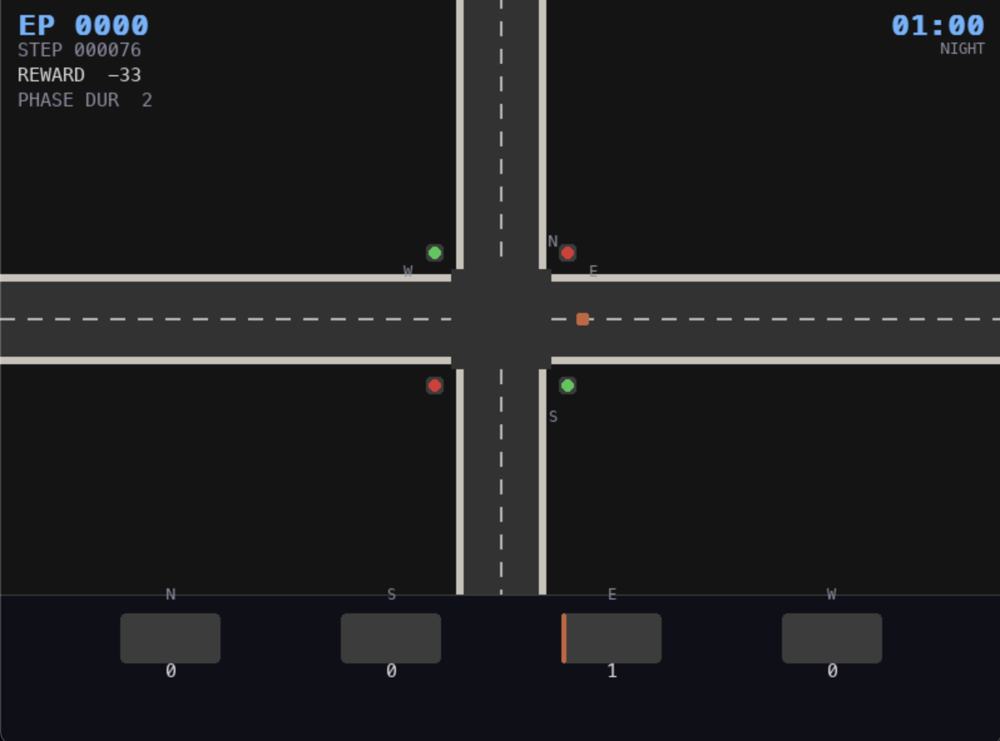

# Traffic Light Controller — Rainbow DQN

Reinforcement learning agent controlling a single intersection traffic light, trained using the Rainbow DQN algorithm implemented in PyTorch.



---

## Project Structure

```
traffic_lights_bot/
├── configs/
│   ├── agent/
│   │   └── rainbow.yaml
│   ├── env/
│   │   └── traffic.yaml
│   ├── train.yaml
│   └── eval.yaml
├── scripts/
│   ├── train.py
│   └── evaluate.py
├── src/
│   ├── environment/
│   │   ├── traffic_env.py
│   │   └── traffic_patterns.py
│   └── rainbow_dqn/
│       ├── agent.py
│       ├── network.py
│       ├── replay_buffer.py
│       └── utils.py
├── viz/
│   └── renderer.py
├── checkpoints/
├── justfile
└── pyproject.toml
```

---

## Environment

Custom Gymnasium environment simulating a single four-way intersection. The agent controls a traffic light with two phases — North/South green or East/West green.

**Observation space** — Box(8,) containing queue lengths for N, S, E, W directions, current phase, current phase duration, and sin/cos encoding of time of day.

**Action space** — Discrete(2): action 0 is North/South green, action 1 is East/West green.

**Reward** — negative sum of all queue lengths at each step. The agent learns to minimize total waiting time across all directions.

**Traffic model** — arrival rates follow a double Gaussian pattern peaking at 08:00 and 17:00. Arrivals are sampled from a Poisson distribution. North/South traffic is heavier in the morning, East/West in the evening. One step corresponds to one minute, one episode covers 1440 steps (24 hours).

---

## Rainbow DQN Components

| Component | Status | Role |
|---|---|---|
| Double DQN | ✅ | Prevents Q-value overestimation under changing traffic patterns |
| Dueling Network | ✅ | Separates state value V(s) from action advantage A(s,a) |
| Prioritized Replay | ✅ | Samples rush hour experiences more frequently |
| Noisy Nets | ✅ | Replaces epsilon-greedy with learned exploration |
| N-step Returns | ✅ | Better credit assignment for delayed effects of signal changes |
| Distributional (C51) | ❌ planned | Models full distribution of waiting times, not just the mean |

---

## Stack

| Library | Purpose |
|---|---|
| torch | Neural networks, autodiff, GPU acceleration |
| torchrl | NoisyLinear, RL building blocks |
| gymnasium | Environment base class |
| pygame-ce | Visualization (Apple Silicon compatible) |
| wandb | Experiment tracking |
| hydra-core | Config management |
| numpy | Replay buffer |

---

## Installation

Requires Python 3.12, [uv](https://github.com/astral-sh/uv).

```bash
git clone https://github.com/yourname/traffic-rainbow-dqn
cd traffic-rainbow-dqn
uv sync
```

---

## Usage

```bash
just train
just eval checkpoints/best
just clean
```

Manual:

```bash
PYTHONPATH=. uv run python scripts/train.py
PYTHONPATH=. uv run python scripts/evaluate.py eval.checkpoint_path=checkpoints/best
```

Override config from CLI (Hydra):

```bash
PYTHONPATH=. uv run python scripts/train.py agent.learning_rate=3e-4 agent.batch_size=64
```

---

## Checkpointing

Model weights are saved using `torch.save` and restored with `load_state_dict`:

```python
torch.save(agent.online_network.state_dict(), "checkpoints/best/model.pt")
agent.online_network.load_state_dict(torch.load("checkpoints/best/model.pt", weights_only=True))
```

---

## References

Hessel et al., Rainbow: Combining Improvements in Deep Reinforcement Learning, AAAI 2018. https://arxiv.org/abs/1710.02298

Schaul et al., Prioritized Experience Replay, ICLR 2016. https://arxiv.org/abs/1511.05952